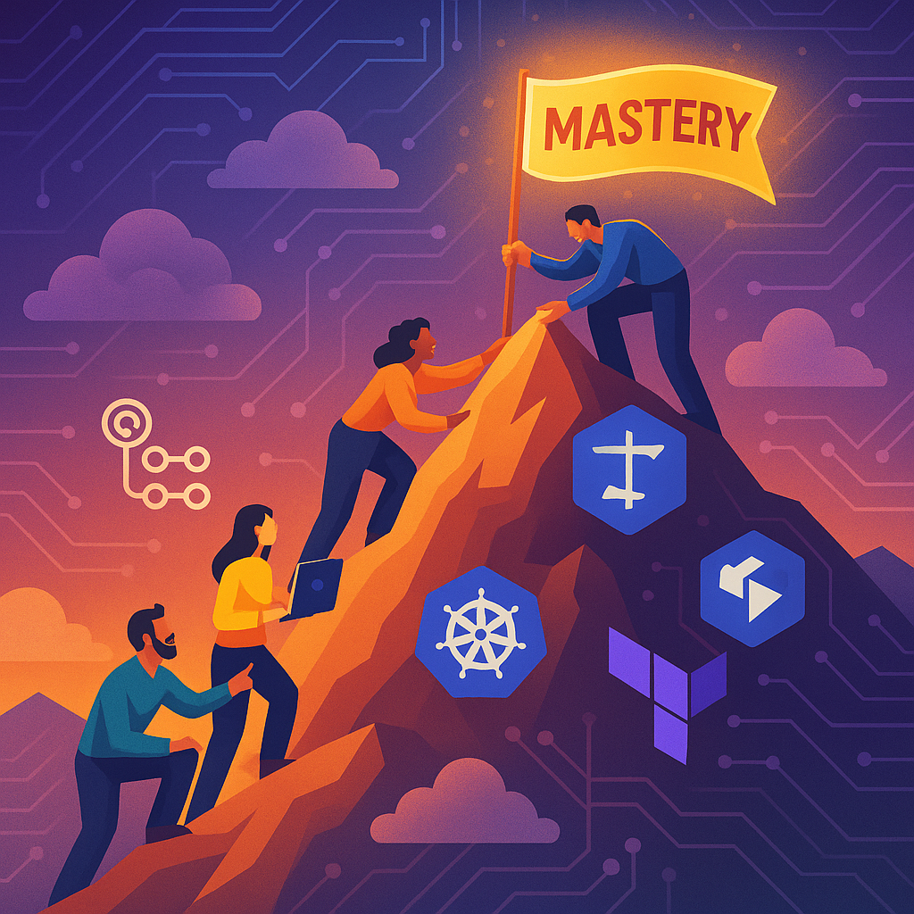

## Laboratório para aprendizado e teste da plataforma _Kubernetes_

Com este laboratório desejamos aprender mais sobre:

1. Arquitetura 
2. Kubernetes
3. CI/CD (devops)
4. Observability
5. Security

### Links importantes

- https://kubernetes.io/
- https://landscape.cncf.io/
- https://www.vultr.com/
- https://argoproj.github.io/
- https://grafana.com/
- https://github.com/features/actions
- https://semver.org/
- https://nvie.com/posts/a-successful-git-branching-model/
- https://developer.hashicorp.com/terraform
- https://www.conventionalcommits.org/pt-br/v1.0.0/

### Ferramentas e serviços

- https://mail.tm/en/
- https://smtp.dev/
- https://temp-mail.org/en/
- https://registro.br/

### Articles
- https://github.com/resources/articles/devops/ci-cd
